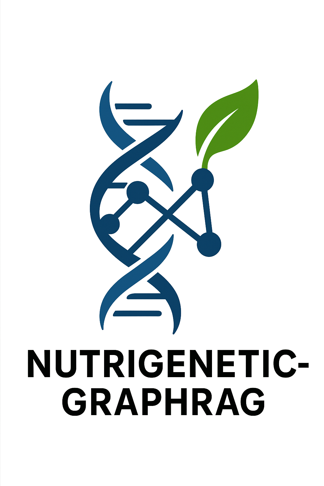

# Nutrigenetic-GraphRAG

<div align="center">
  
  <p><strong>Graph-based RAG for Biomedical Nutrigenetic Applications</strong></p>
  <p>
    =3.9-blue">
    
    
  </p>
</div>

## Overview

**Nutrigenetic-GraphRAG** is an advanced, local-first retrieval augmented generation system, tailored for biomedical knowledge discovery and personalized nutrition counseling. Built on top of the excellent [nano-graphrag](https://github.com/gusye1234/nano-graphrag), this project adapts entity extraction and graph-based RAG (Retrieval Augmented Generation) to the unique linguistic and conceptual challenges of nutrigenomics.

Our system empowers **customers**, **nutritionists**, and **researchers** to explore complex nutrigenetic interactions, query biomedical knowledge graphs in natural language, and receive context-rich, explainable answers.  
All components run locally using [Ollama](https://github.com/ollama/ollama) for LLMs and [sentence-transformers](https://www.sbert.net/) for embedding, ensuring privacy, speed, and cost effectiveness.

---

> **Credit:** This work is deeply inspired by [nano-graphrag](https://github.com/gusye1234/nano-graphrag). We adapted and extended its architecture for the challenges of nutrigenetic counseling and biomedical entity modeling.

---

## Features

- **Biomedical entity extraction:** Customized extraction for genes, nutrients, phenotypes, and variants.
- **Graph-based RAG:** Graph-building and retrieval that retains biomedical relationships for nuanced responses.
- **Ablation study**: Easily swap LLMs (via Ollama) and embedders (via sentence-transformers) for benchmarking.
- **Multi-user design:** Suitable for consumers, domain expert nutritionists, and researchers.
- **Privacy-first:** 100% local processing — no cloud LLMs or embeddings.
- **Incremental updates:** Efficiently add or update documents and knowledge bases.
- **Asynchronous API:** Fast, concurrent ingestion and query capabilities.

## Installation

### Prerequisites

- Python 3.9+
- [Ollama](https://github.com/ollama/ollama) installed and running
- At least one supported local sentence-transformer model

### Setup

```bash
# clone this repo
git clone https://github.com/YOUR_USERNAME/nutrigenetic-graphrag.git
cd nutrigenetic-graphrag

# Install requirements
pip install -r requirements.txt
```

If using under editable mode for development:

```bash
pip install -e .
```

## Quick Start

1. **Prepare your biomedical corpus:** Place plain text, PDF, or .csv in the `data/` folder.
2. **Run Ollama:**  
   E.g., `ollama serve`
3. **Start embedding model download:**  
   (Refer to sentence-transformers documentation or see script in `scripts/`)
4. **Build your graph RAG:**

```python
from nutrig-graphrag/nano_graphrag import GraphRAG, QueryParam
from nutrig-graphrag/biomedical.llm_utils import NutrigGraphRAG

# Initialize
ngrag = NutrigGraphRAG(
    working_dir="nutrig-graphrag/biomedical/nutrig-graphrag",
    llm_model="gemma2-9b-it",
    embedding_model="all-MiniLM-L6-v2",
)

# Ingest documents
for doc in ["data/pubmed_1.txt", "data/pubmed_2.txt"]:
    with open(doc) as f:
        ngrab.insert(f.read())

# Query knowledge graph
print(ngrag.query(
    "How does the MTHFR C677T variant affect folate metabolism?",
    param=QueryParam(mode="global")
))
```

## Architecture

Nutrigenetic-GraphRAG extends `nano-graphrag`, modifying:

- **Entity extraction prompts** for biomedical NER.
- **Chunking** to preserve biomedical sentence/paragraph semantics.
- **Custom embeddings** for domain adaptation.
- **Ablation pipeline** for benchmarking various LLMs/embedders.

See [docs/ARCHITECTURE.md](./docs/ARCHITECTURE.md).

## Benchmarking: LLM & Embedding Ablation

We provide scripts for ablation experiments to compare:

- Different LLMs accessible via Ollama (e.g., Deepseek-v2, Gemma 2, Qwen2.5)
- Multiple sentence-transformer models

Models evaluated:

**Embedders:**
- `all-mpnet-base-v2`
- `dmis-lab/biobert-v1.1`

**LLMs:**

- `gemma2:9b`
- `gemma2:27b`
- `llama3.1:8b`
- `qwen2:7b`
- `qwen2.5:14b`
- `deepseek-v2:16b`

Results (see [docs/RESULTS.md](./docs/RESULTS.md)):
- Best LLM: _[update this with your result]_
- Best Embedder: _[update this with your result]_

## Applications

- **Personalized nutrition counseling** for consumers
- **Decision support** for clinical nutritionists
- **Biomedical discovery** for researchers (variant-disease-nutrient links)


## Roadmap

- Integrate gene-variant linking to dietary guidelines
- Add graph visualization
- Expand biomedical entity database
- More LLM and embedder plug-ins

See [ROADMAP.md](./ROADMAP.md).

## Acknowledgements

This project would not exist without [nano-graphrag](https://github.com/gusye1234/nano-graphrag) by [gusye1234](https://github.com/gusye1234).

Also inspired by:
- [Ollama](https://github.com/ollama/ollama)
- [sentence-transformers](https://github.com/UKPLab/sentence-transformers)
- Biomedical GRPM datasets (https://doi.org/10.1016/j.jbi.2025.104845)

## Citation

If you use this software, please cite both nano-graphrag and this repo.

```bibtex
@misc{nutrigenetic-graphrag,
  author = {johndef64},
  title = {Nutrigenetic-GraphRAG: Biomedical GraphRAG for Nutrigenetics},
  year = {2024},
  howpublished = {\url{https://github.com/johndef64/nutrigenetic-graphrag}},
  note = {Adapted from nano-graphrag https://github.com/gusye1234/nano-graphrag}
}
```

## License

MIT License. See [LICENSE](./LICENSE).